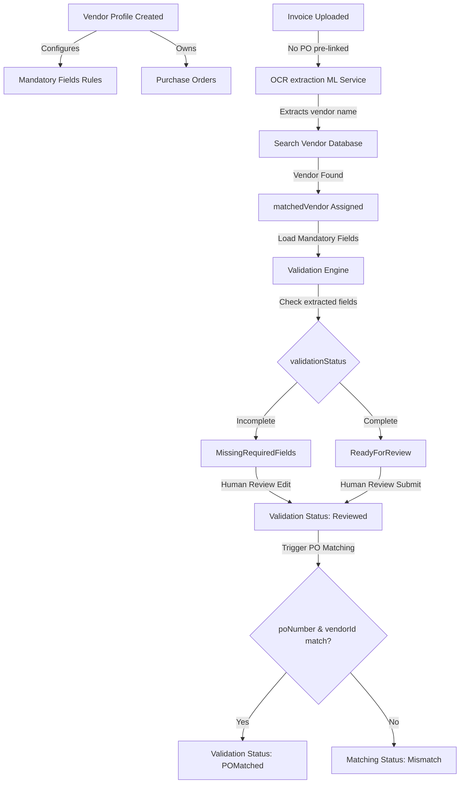

# AP Invoice Automation System (Vendor-Centric accounts payable Workflow)

AP Invoice Automation System is a production-ready enterprise accounts payable workflow platform. The architecture is built as a highly decoupled layout consisting of a Node.js Express backend, a React SPA frontend, and a Python Flask ML helper service.

---

## 1. Project Overview
This project automates Accounts Payable transactions using a **Vendor-Centric workflow**. The platform handles vendor onboarding, purchase order generation, receipt/invoice ingestion, AI-driven OCR extraction, automated vendor field validation, human review validation, automated PO matching, and approval pipelines.

---

## 2. Architecture Overview
The system uses a modern, three-tier architecture:
- **Frontend SPA**: React (Vite) + Tailwind CSS + Axios.
- **REST API Backend**: Node.js + Express.js + Mongoose (MongoDB).
- **Machine Learning Service**: Python + Flask + PaddleOCR + LayoutLMv3.

### Decoupled Data & Validation Flow


---

## 3. Installation Steps

### Prerequisites
- **Node.js**: v18.x or higher
- **Python**: v3.8 or higher
- **MongoDB**: Active local daemon instance or connection string

### Setup Commands

#### Backend Installation
```bash
cd backend
npm install
```

#### Frontend Installation
```bash
cd frontend
npm install
```

#### ML Service Installation
```bash
cd ml-service
python -m venv venv
# Activate virtual environment (Windows)
.\venv\Scripts\Activate.ps1
# Install packages
pip install -r requirements.txt
```

---

## 4. Run Frontend
To launch the Vite development server locally (on port `3000`):
```bash
cd frontend
npm run dev
```

---

## 5. Run Backend
To start the Express server using `nodemon` for file-watching hot-reloads (on port `5000`):
```bash
cd backend
npm run dev
```

---

## 6. Run ML Service
To start the Flask machine learning microservice (on port `8000`):
```bash
cd ml-service
.\venv\Scripts\activate
python app.py
```

---

## 7. Database Migration
To migrate an existing database to the new vendor-centric AP architecture, run:
```bash
cd backend
node src/scripts/migrate.js
```
This migrates existing invoices by setting `matchedVendor = null`, `matchedPO = null`, `validationStatus = Pending`, and resets existing purchase orders by setting `vendorId = null`.

---

## 8. Database Schema

### Vendor Model
- `vendorCode` (String, unique, required)
- `vendorName` (String, required)
- `vendorEmail` (String, required, email validated)
- `vendorGST` (String, required)
- `vendorPhone` (String)
- `vendorAddress` (String)
- `isActive` (Boolean, default true)
- `mandatoryFields` (Array of Strings, valid values: `invoiceNumber`, `poNumber`, `invoiceDate`, `totalAmount`, `gstNumber`)

### PurchaseOrder Model
- `poNumber` (String, unique, required)
- `vendorId` (ObjectId, ref Vendor, required on creation)
- `vendorName` (String, required)
- `vendorEmail` (String, required)
- `poDate` (Date, required)
- `expectedDeliveryDate` (Date)
- `totalAmount` (Number, required)
- `currency` (String, default 'USD')
- `status` (String, enum: `Draft`, `Open`, `Closed`, `Cancelled`, default `Draft`)
- `createdBy` (ObjectId, ref User, required)

### Invoice Model
- `invoiceFileUrl` (String, required)
- `invoicePublicId` (String, required)
- `originalFileName` (String, required)
- `extractionStatus` (String, enum: `Pending`, `Processing`, `Completed`, `Failed`, default `Pending`)
- `matchingStatus` (String, enum: `NotMatched`, `Matched`, `Mismatch`, default `NotMatched`)
- `validationStatus` (String, enum: `Pending`, `MissingRequiredFields`, `ReadyForReview`, `Reviewed`, `POMatched`, default `Pending`)
- `reviewStatus` (String, enum: `PendingReview`, `Reviewed`, default `PendingReview`)
- `matchedVendor` (ObjectId, ref Vendor, default null)
- `matchedPO` (ObjectId, ref PurchaseOrder, default null)
- `extractedData`:
  - `invoiceNumber` (String)
  - `poNumber` (String)
  - `vendorName` (String)
  - `invoiceDate` (String)
  - `totalAmount` (Number)
  - `taxAmount` (Number)
  - `gstNumber` (String)
- `confidenceScores`: (Numeric fields from 0 to 100 for each extracted data key)
- `uploadedBy` (ObjectId, ref User, required)
- `reviewedBy` (ObjectId, ref User, default null)
- `reviewedAt` (Date, default null)

---

## 9. Role-Based Access Control (RBAC)

| User Role | Vendor Management | PO Management | Invoice Ingestion | Review & Validation |
| :--- | :---: | :---: | :---: | :---: |
| **Admin** | Create, Edit, Deactivate, View | Create, Edit, Cancel, View | Upload, Delete, View | Full Review Submit |
| **Manager** | Create, Edit, View | Create, Edit, View | Upload, View | Full Review Submit |
| **AccountsExecutive** | View | View | Upload, View | Full Review Submit |
| **Employee** | No Access | No Access | No Access | No Access |

---

## 10. API Documentation

### Vendor APIs

#### `POST /api/vendors`
Creates a new business vendor profile.
- **Access**: Private (Admin, Manager)
- **Request Body**:
  ```json
  {
    "vendorCode": "V-ACME-001",
    "vendorName": "Acme Corp Solutions",
    "vendorEmail": "billing@acme.com",
    "vendorGST": "22AAAAA1111A1Z1",
    "vendorPhone": "+1 (555) 123-4567",
    "vendorAddress": "128 Business Road, TX",
    "mandatoryFields": ["invoiceNumber", "poNumber", "gstNumber"]
  }
  ```

#### `GET /api/vendors`
Retrieves lists of all configured vendors.
- **Access**: Private (Admin, Manager, AccountsExecutive)

#### `GET /api/vendors/:id`
Retrieves detailed profiles of a single vendor by ID.
- **Access**: Private (Admin, Manager, AccountsExecutive)

#### `PUT /api/vendors/:id`
Updates vendor configuration parameters.
- **Access**: Private (Admin, Manager)

#### `PATCH /api/vendors/:id/deactivate`
Deactivates a vendor profile.
- **Access**: Private (Admin only)

---

### Purchase Order (PO) APIs

#### `POST /api/po`
Creates a new purchase order, linked to a vendor.
- **Access**: Private (Admin, Manager)
- **Request Body**:
  ```json
  {
    "poNumber": "PO-2026-0001",
    "vendorId": "60d0fe4f5311236168a109cb",
    "vendorName": "Acme Corp Solutions",
    "vendorEmail": "billing@acme.com",
    "totalAmount": 4250.00,
    "currency": "USD",
    "status": "Open"
  }
  ```

---

### Invoice Human Review APIs

#### `GET /api/review/:invoiceId`
Fetches the extracted OCR fields, confidence scores, and matched vendor rules.
- **Access**: Private (Admin, Manager, AccountsExecutive)

#### `PUT /api/review/:invoiceId`
Saves reviewed invoice parameters. Performs mandatory field checks and automatically runs PO Matching.
- **Access**: Private (Admin, Manager, AccountsExecutive)
- **Request Body**:
  ```json
  {
    "invoiceNumber": "INV-109283",
    "poNumber": "PO-2026-0001",
    "vendorName": "Acme Corp Solutions",
    "invoiceDate": "2026-06-08",
    "totalAmount": 4250.00,
    "taxAmount": 250.00,
    "gstNumber": "22AAAAA1111A1Z1",
    "vendorId": "60d0fe4f5311236168a109cb"
  }
  ```
- **Response (200 OK - Validation Engine Passed)**:
  ```json
  {
    "status": "success",
    "message": "Invoice review saved and matched successfully",
    "data": {
      "validationStatus": "POMatched",
      "matchingStatus": "Matched",
      "matchedVendor": { ... },
      "matchedPO": { ... }
    }
  }
  ```
- **Response (400 Bad Request - Mandatory Fields Missing)**:
  ```json
  {
    "status": "error",
    "message": "Validation failed: Mandatory fields are missing.",
    "missingFields": ["poNumber", "gstNumber"]
  }
  ```
